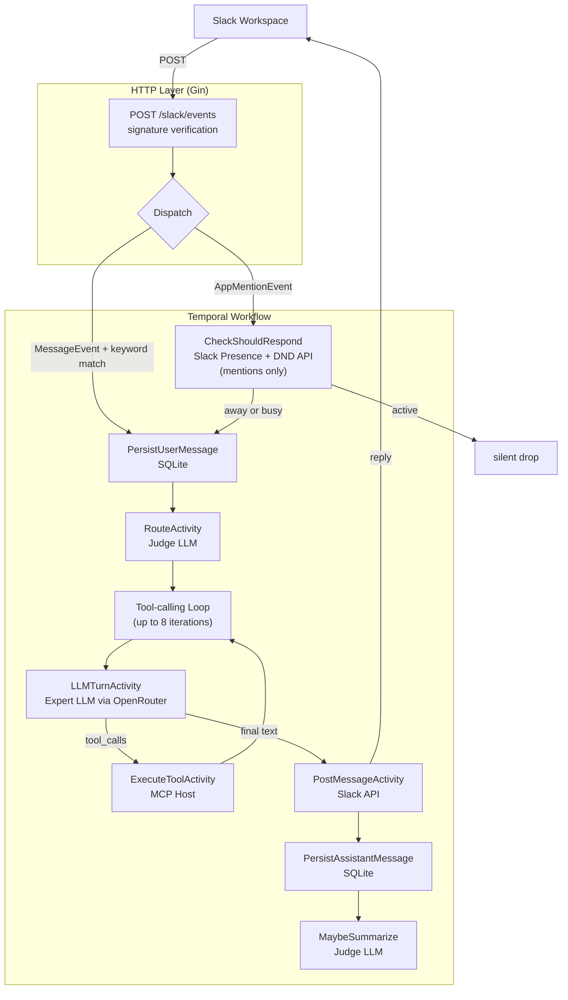

<div align="center">
  

  # Agent Go-Go

  **An open-source LLM-powered Slack bot written in Go — built for the Go community.**

  When you're Away or Busy, Agent Go-Go responds to Slack messages as you, routing each message to the right model for the job.

  [](https://github.com/scarlett-danger/Agent-Go-Go/actions/workflows/ci.yml)
  [](https://github.com/scarlett-danger/Agent-Go-Go/actions/workflows/deploy.yml)
  
  
  
  
  
</div>

---

## What is Agent Go-Go?

Agent Go-Go is an open-source Slack bot that steps in when you step away. Set your Slack status to **Away** or **Busy** and the bot answers `@mentions` on your behalf. In channels it only speaks up when someone uses a configured **trigger keyword** — so it stays quiet unless it's actually needed.

Under the hood each message is a **Temporal workflow**: durable, retryable, and replay-safe. A lightweight judge LLM classifies the message and routes it to the best available expert model. Tool calls go through an MCP host (filesystem, web fetch, SQLite), and every conversation is stored in a local SQLite database with rolling summarisation to keep context within the model's window.

Built with Go and Temporal, Agent Go-Go is a reference project for the Go community showing how to wire together LLMs, durable workflows, MCP tool servers, and Slack's Events API in a single deployable binary.

---

## Architecture



| Component | Role |
|---|---|
| **Gin** | HTTP server — verifies Slack signatures, ACKs within 3 s, dispatches async |
| **Temporal** | Durable workflow engine — retries, deduplicates Slack's at-least-once delivery |
| **Judge LLM** | Small fast model (configurable) — classifies messages into routing categories |
| **Expert LLM** | Per-category model selected from `routing.yaml` — produces the final reply |
| **MCP Host** | Subprocess manager — exposes filesystem, web fetch, and SQLite tools to the expert |
| **SQLite** | Conversation memory — stores turns, rolling summaries, dedup timestamps |
| **OpenRouter** | Single API key — serves both judge and expert models, forwards traces to Langfuse |
| **Sentry** | Error tracking — captures infrastructure failures (not LLM errors, those go to Langfuse) |

---

## Quick Start (Local)

### Prerequisites

| Tool | Version | Install |
|---|---|---|
| Go | 1.22+ | [go.dev](https://go.dev/dl/) |
| Temporal CLI | latest | `brew install temporal` / [docs](https://docs.temporal.io/cli) |
| ngrok | any | [ngrok.com](https://ngrok.com/download) |

### 1. Clone and configure

```bash
git clone https://github.com/scarlett-danger/Agent-Go-Go.git
cd Agent-Go-Go
cp .env.example .env
```

Open `.env` and fill in at minimum:

```bash
SLACK_USER_TOKEN=xoxp-...          # from Slack app → OAuth & Permissions
SLACK_SIGNING_SECRET=...           # from Slack app → Basic Information
OPENROUTER_API_KEY=sk-or-v1-...   # from openrouter.ai/keys
```

Optional — configure trigger keywords so the bot only responds to relevant channel messages:

```bash
TRIGGER_KEYWORDS=agent go-go,go-go
```

### 2. Create your Slack app

1. Go to [api.slack.com/apps](https://api.slack.com/apps) → **Create New App** → **From scratch**.
2. Under **OAuth & Permissions** add these **User Token Scopes**:

   ```
   chat:write  channels:history  groups:history
   im:history  mpim:history  users:read  dnd:read
   ```

3. Install the app to your workspace and copy the **User OAuth Token** (`xoxp-…`) into `SLACK_USER_TOKEN`.
4. Under **Event Subscriptions** → **Subscribe to events on behalf of users**, add:

   ```
   message.channels  message.groups  message.im  message.mpim
   ```

   And under **Subscribe to bot events**:

   ```
   app_mention
   ```

5. Leave the Request URL blank for now — you'll fill it in after ngrok is running.

### 3. Run the stack

Open **three terminals**:

```bash
# Terminal 1 — Temporal dev server (in-memory, no persistence across restarts)
temporal server start-dev
```

```bash
# Terminal 2 — Agent Go-Go
go run .
```

```bash
# Terminal 3 — ngrok tunnel
ngrok http 8080 --log=stdout
```

Copy the `https://…ngrok-free.app` URL from ngrok's output, then in your Slack app go to **Event Subscriptions** → set the Request URL to:

```
https://<your-ngrok-domain>/slack/events
```

Slack will send a challenge — the app responds automatically. Save the URL and you're live.

**Health checks:**

```bash
curl http://localhost:8080/health
curl -H "ngrok-skip-browser-warning: true" https://<your-ngrok-domain>/health
```

> **Tip — ngrok tunnel already running?**
> If you see `ERR_NGROK_334`, an existing tunnel owns that port. Reuse it (`http://127.0.0.1:4040/api/tunnels` shows the current URL) or kill it first:
> ```powershell
> Get-Process ngrok -ErrorAction SilentlyContinue | Stop-Process -Force
> ```

---

## Production Deployment

### 1. Build the Docker image

The included `Dockerfile` produces a minimal Debian-based image with the Go binary, Node.js (for MCP filesystem/fetch servers), and `uv` (for the MCP SQLite server).

```bash
docker build -t agent-go-go:latest .
docker run --env-file .env -p 8080:8080 agent-go-go:latest
```

### 2. Deploy to Fly.io

Fly.io is the recommended platform — the Dockerfile is already tuned for it and expects a persistent volume at `/app/data` for SQLite.

```bash
fly launch          # creates fly.toml, sets region
fly volumes create agent_data --size 1   # persistent SQLite + workspace
fly secrets set \
  SLACK_USER_TOKEN="xoxp-..." \
  SLACK_SIGNING_SECRET="..." \
  OPENROUTER_API_KEY="sk-or-v1-..." \
  TEMPORAL_HOST_PORT="<your-temporal-host>:7233"
fly deploy
```

The app exposes `/health` — Fly uses it as the health check endpoint (see `HEALTHCHECK` in the Dockerfile).

### 3. Connect Temporal

For production you need a persistent Temporal service. Options:

| Option | Notes |
|---|---|
| **Temporal Cloud** | Managed, recommended for most teams. Set `TEMPORAL_HOST_PORT` to your Cloud endpoint. |
| **Self-hosted** | Deploy the [Temporal server](https://docs.temporal.io/self-hosted-guide) alongside the app. |
| **Dev server** | `temporal server start-dev` — fine for staging, data lost on restart. |

### 4. Update your Slack app

Set the Event Subscriptions Request URL to your production domain:

```
https://<your-fly-app>.fly.dev/slack/events
```

### Environment variables reference

| Variable | Required | Default | Description |
|---|---|---|---|
| `SLACK_USER_TOKEN` | ✅ | — | User OAuth token (`xoxp-…`) |
| `SLACK_SIGNING_SECRET` | ✅ | — | Request signature verification |
| `SLACK_USER_ID` | | auto-detect | Bot's own Slack user ID (loop guard) |
| `OPENROUTER_API_KEY` | ✅ | — | OpenRouter API key |
| `OPENROUTER_URL` | | `https://openrouter.ai/api/v1` | Override for proxies |
| `JUDGE_MODEL` | | `openai/gpt-oss-20b:free` | Model used for routing classification and summarisation |
| `TRIGGER_KEYWORDS` | | *(respond to all)* | Comma-separated keywords required in channel messages |
| `DB_PATH` | | `./data/bot.db` | SQLite database path |
| `MEMORY_MAX_TURNS` | | `20` | Max conversation turns passed to the model |
| `MEMORY_SUMMARIZE_AT` | | `30` | Turn count that triggers summarisation |
| `MEMORY_SUMMARIZE_FOLD` | | `10` | Number of turns folded into each summary |
| `ROUTING_CONFIG` | | `./config/routing.yaml` | Path to routing config |
| `MCP_CONFIG` | | `./config/mcp.yaml` | Path to MCP server config |
| `TEMPORAL_HOST_PORT` | | `localhost:7233` | Temporal server address |
| `TEMPORAL_NAMESPACE` | | `default` | Temporal namespace |
| `TEMPORAL_TASK_QUEUE` | | `Agent-Go-Go-queue` | Temporal task queue name |
| `SERVER_PORT` | | `8080` | HTTP listen port |
| `SENTRY_DSN` | | *(disabled)* | Sentry DSN for infrastructure error tracking |
| `SENTRY_ENVIRONMENT` | | `development` | `development` or `production` |
| `SENTRY_TRACES_SAMPLE_RATE` | | `0.2` | Sentry trace sampling (0.0–1.0) |

---

## Testing

### Unit tests

```bash
go test ./...
```

> The test suite is in early stages. Contributions adding unit tests for the router, judge, and memory packages are very welcome — see [Contributing](#contributing).

### Judge smoke test

`cmd/judge-test` is an end-to-end smoke test for the routing judge. It sends a representative prompt for each routing category to the live judge model and reports whether each one landed in the expected bucket.

```bash
# Run the built-in prompt suite against your configured judge model
go run ./cmd/judge-test

# Test a single custom prompt
go run ./cmd/judge-test "explain the difference between a mutex and a channel"
```

Example output:

```
Judge model: openai/gpt-oss-20b:free
Categories:  7
Default:     general

  ✓  general       "hi how are you"
  ✓  code          "fix the null pointer bug in my Java code"
  ✓  research      "what's the latest CVE for OpenSSL"
  ✓  reasoning     "if a train leaves Boston at 60mph..."
  ✓  multilingual  "traduisez ceci en anglais: bonjour le monde"
  ✓  creative      "write me a short poem about a tired developer"
  ✓  recall        "what did we discuss yesterday about the auth refactor"

=== Summary: 7/7 expected matches ===
```

> The judge has deliberate discretion on borderline prompts — a miss on an ambiguous message is not a bug. Only worry if everything routes to a single category.

The smoke test requires `OPENROUTER_API_KEY` in your `.env`. You can stub the Slack env vars since they're validated by `config.Load` even though the test doesn't use them:

```bash
SLACK_USER_TOKEN=xoxp-stub SLACK_SIGNING_SECRET=stub go run ./cmd/judge-test
```

---

## Contributing

Agent Go-Go is open source and contributions from the Go community are welcome. See [CONTRIBUTING.md](CONTRIBUTING.md) for the full guide — setup, code style, testing requirements, and the PR checklist.

Good first areas: adding unit tests, extending routing categories in `config/routing.yaml`, adding new MCP tool servers in `config/mcp.yaml`.

---

## License

MIT — see [LICENSE](LICENSE) for details.
